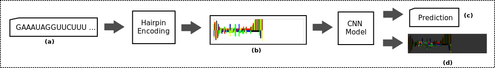
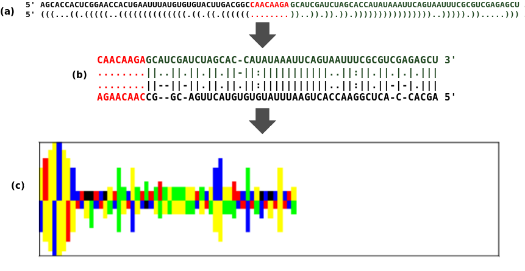

# master-project

Repository containing the scripts used to train CNN models for pre-miRNA detection.

## Intro

Pre-miRNAs are small RNA sequences of about 60-80 nucleotides long. MicroRNAs (miRNAs) are smaller RNA sequences derived from pre-miRNAs that are involved in several biological processes such as the the development of the nervous system, muscle development, and formation of
blood vessels. In humans, miRNAs can be present in fluids and can be associated to some diseases. Such characteristics make them suitable candidates for biomarkers.

Methods for pre-miRNA detection are used in tandem with miRNA detection procedures to identify novel miRNAs. In this work, deep convolutional neural networks are used to identify pre-miRNAs from candidate nucleotide sequences.

The proposed pre-miRNA detection framework is shown in the figure below. In summary, a hairpin encoding algorithm encodes nucleotide sequences as RGB images revealing potential spatial patterns. Such images are then classified by CNN models as valid pre-miRNAs (or not).

The figure below depicts the way nucleotide sequences are encoded as RGB images.

More details of the encoding procedure can be found in the thesis document.

## Datasets description
Two different datasets were used to train and evaluate CNN models for this work: *allmirbase* and *hsa*. The folder *datasets* contains numpy files (.npz) storing the images, names, and labels associated to both *allmirbase* and *hsa*.

## Scripts description
Different types of CNNs were trained and evaluated in this work. The best models are contained in the *best_models* folder. The scripts contained in the *src* folder were used to train many different CNN models. The *src/model_generators* folder contains the architecture of the different CNN models trained using the training scripts.

For instance, the *final_vgg_model_trainer_hsa.py* trains VGG like models for the *hsa* dataset. The models to train are defined in the *model_generators/final_vgg_model_generator_hsa.py* script.

For a more detailed description of the types of CNNs trained and evaluated in this work, consult the thesis document.
